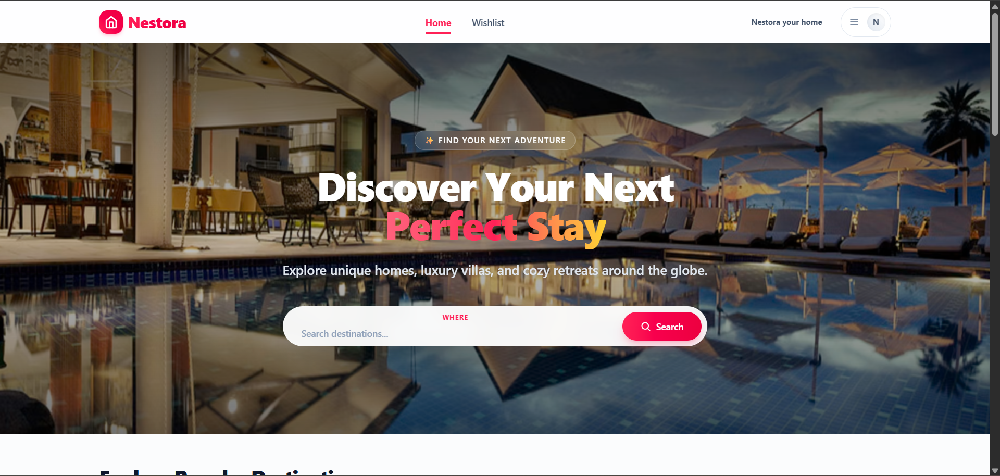

# 🏡 Nestora

> A modern Airbnb-inspired vacation rental frontend built with **React**, **Vite**, and **Tailwind CSS**.

---

## 📖 About

Nestora is a modern frontend web application that allows users to explore premium vacation stays through a clean, responsive, and intuitive interface.

Users can search properties by destination or property name, view detailed listings, and save their favorite stays using a persistent wishlist powered by Local Storage.

The project demonstrates component-based architecture, client-side routing, responsive design, and state management using React while following clean coding practices.

---

## ✨ Features

* 🔍 Search properties by destination or property name
* 🏠 Browse premium vacation rentals
* 📄 Detailed property pages
* ❤️ Add & remove properties from Wishlist
* 💾 Persistent Wishlist using Local Storage
* 📱 Fully responsive design
* ⚡ Fast performance with Vite

---

## 🛠️ Tech Stack

* React
* Vite
* Tailwind CSS
* React Router
* JavaScript (ES6+)

---

## 📸 Preview

---

## 🌐 Live Demo

🔗 https://nestora-fawn.vercel.app/

---

## 👨‍💻 Developer

**Saksham Parashar**
